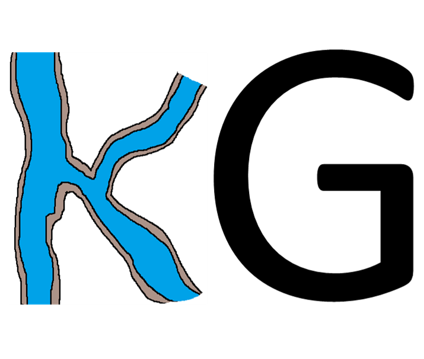

# KARSTGEN1.0
 

- KarstGen was developped in HydroSciences Montpellier (http://www.hydrosciences.org/).
- Part of the tool was developped within the framework of KARMA Project (http://karma-project.org/).

      

## Correspondance:
Mohammed Aliouache (mohammed.aliouache@umontpellier.fr), 

Hervé Jourde (herve.jourde@umontpellier.fr)

## To cite:
Aliouache M., Jourde H. and Wang X. (2023) KARSTGEN : Incipient karst genesis in fractured carbonate rocks, Github: https://www.github.com/maliouache/KARSTGEN

## Description:
This code simulate incipient karst genesis in fractured carbonate rocks for 2D discrete fracture networks. It couples fluid flow and reactive solute transport in fractures, after discretizing (segments)  the DFN for flow and transport simulation, using a two parrallel plates model (Aliouache et al., 2019), according to the following workflow :

Simulations stop automatically when Reynolds number exceeds 2100 in one fracture segment (the code is designed for laminar flow, only)
The code will automatically extract the backbone of the discrete fracture network, thus, please make sure to have a well connected DFN.
	
## Assumptions:
- Quasi-stationary approximation (Ortleva et al. 1987; Lichtner 1988)
- Instant mixing from the fracture wall to the middle of the fracture (high flow velocity location) – Advection limited reaction
- Linear reaction kinetics
- Fully saturated medium
- Mass conservation at intersections between fractures (nodes)
- Flow and transport in fractures only
- Complete mixing of solute at nodes

	
## Installation
Install matlab Runtime from Install/ folder

## To use:
The code requires matlab core to be installed (a standalone application with required programs is found in Install/ folder)
		
### Step 1: 
Prepare the initial DFN to use in the simulation by respecting the following format: the DFN is defined by discretizing fractures into segments (please, make sure that all the intersections are defined as nodes). The segments are then provided in the segments.txt input file as below:

	X1		Y1		X2		Y2		Aperture
	.		.		.		.		.
	.		.		.		.		.
	.		.		.		.		.

X1,Y1,X2 and Y2 are the coordinates of the two points defining each line segment. The tool can read .txt and .mat formats
	
### Step 2: 
Save the segments defining the DFN in .txt or .mat format and launch KarstGen program in Use/ folder
	
### Step 3: 
Load the segments file then define the different input parameters (default values are already provided):
- Output folder					--> defines the name of the folder containing the segments file
- Flow direction				--> defines the flow boundary direction type (can be: x-direction, y-direction or concentrated recharge points). Note that rnd-direction will randomly defines nodes in the model as input and output (10 input points and one output point)
- Flow type					--> defines the type of boundary conditions (can be: constant head or constant flow rate)
- Hin or Qin					--> defines the input value for flow (in case of constant head boundary condition, please provide the hydraulic head at the input nodes in meters, else, in case of constant flow rate boundary condition, please provide the flow rate at each input nodes in m3/s)
- Hout						--> defines the hydraulic head at the outlet boundary condition (default set to 0 m)
- Dissolution time step dt (seconds)		--> defines the dissolution timestep in seconds
- Kinetics of the reaction (m/s)			--> defines the kinetics of limestone dissolution 
- Max number of iterations			--> defines the maximum number of iteration. Note that the simulation will automatically stop either if the Reynolds number exceeds Re>2100 or if the maximum number of iteration is reached
- Water dynamic viscosity (in Pa.s)		--> defines the water dynamic viscosity and displays the equivalent temperature
- Equilibrium concentration (Mole/m3)	--> defines the calcium (Ca2+) equilibrium concentration
		
### Step 4: 
Launch the simulation by clicking on Run button

### Step 5: 
Results are saved inthe the output folder (default: ./Output)
	
## Applications:
- Aliouache, M., Wang, X., Jourde, H., Huang, Z., & Yao, J. (2019). Incipient karst formation in carbonate rocks: Influence of fracture network topology. Journal of Hydrology, 575, 824-837. Doi: https://doi.org/10.1016/j.jhydrol.2019.05.082 
- Wang, X., Aliouache, M., Wang, Y., Lei, Q., Jourde, H., 2021. The role of aperture heterogeneity in incipient karst evolution in natural fracture networks: insights from numerical simulations. Adv. Water Resour. 156, 104
	
